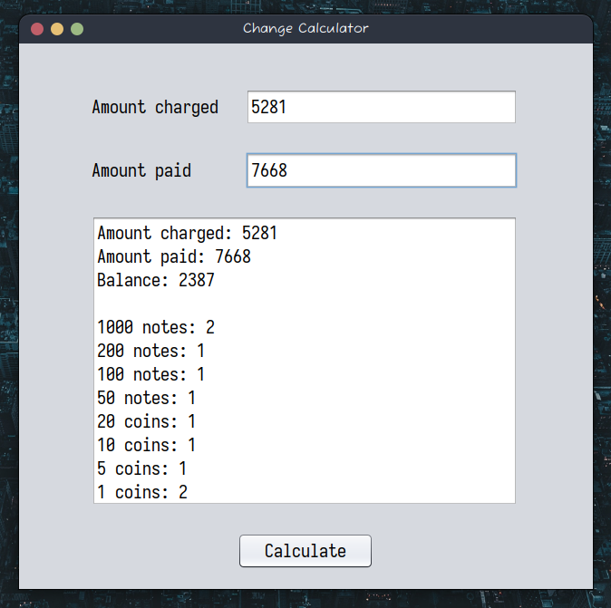

# CHANGE CALCULATOR

---

## Overview

This is an application that calculates the balance of a transaction based on the amount charged and the amount paid.
It calculates the balance and displays the balance in denominations of:

- 1000 shillings note
- 500 shillings note
- 200 shillings note
- 100 shillings note
- 50 shillings note
- 20 shillings coin
- 10 shillings coin
- 5 shillings coin
- 1 shillings coin

The above denominations are the denominations used in Kenya currently.

### Screenshots

### Built with

- Java Swing

---

## Author

-   Portfolio - [Makechi](https://love-makechi.web.app)
-   Twitter - [@OEMakbe](https://www.twitter.com/OEMakbe)
